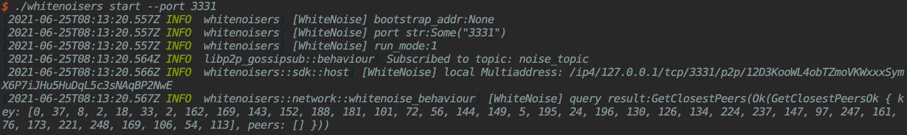
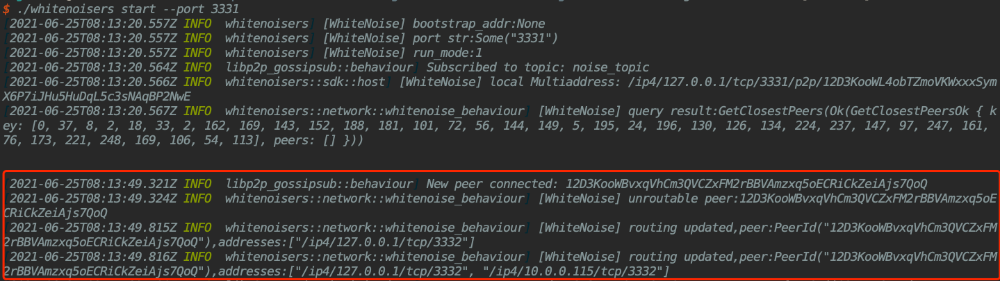
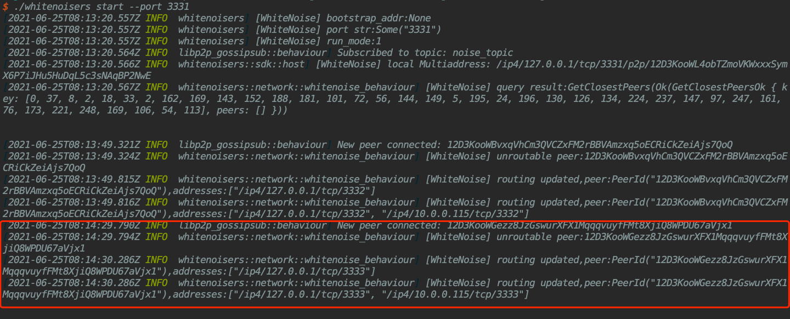

# WhiteNoise.rs

The implementation of privacy p2p network protocol in Rust

## WhiteNoise Protocol

WhiteNoise is an overlay privacy network protocol. It is designed to provide comprehensive network privacy protection,
including link privacy, node privacy, data privacy and traffic privacy. It is also a decentralized and open network.
Anyone can act as a Node participate in the network to relay data transmissions, or a Terminal to use private
connections.

WhiteNoise Protocol has superior robustness, ease of use, and cross-platform. It can provide safe and reliable
transmission capabilities in a very friendly manner, allowing upper-layer applications to easily and confidently focus
on their own business innovations. The privacy of the data is fully guaranteed by WhiteNoise.

Learn more [specifics about WhiteNoise](docs/whitenoise_spec.md) and WhiteNoise multi-hop connection [Workflows](./docs/workflows.md).

## Build

Building WhiteNoise requires Rust toolchain. See more for how to install
Rust [here](https://www.rust-lang.org/tools/install).

Use the following command to build the WhiteNoise node:

```shell
cargo build --release
```

## Embedded Docs

Once the project has been built, the following command can be used to explore all parameters and subcommands:

```shell
./target/release/whitenoisers -h
```

## Run

### Start Local WhiteNoise Network
At first, we suggest user build 5 directories at least, contains boot and node1/2/3/4
```shell
mkdir boot node1 node2 node3 node4    
```

By then, we can build soft link from whitenoisers binary to above directories:
```shell
cd directory/of/boot
ln -s binary/path/of/whitenoisers directory/of/boot/whitenoisers

cd directory/of/node1
ln -s binary/path/of/whitenoisers directory/of/node1/whitenoisers

cd directory/of/node2
ln -s binary/path/of/whitenoisers directory/of/node2/whitenoisers

cd directory/of/node3
ln -s binary/path/of/whitenoisers directory/of/node3/whitenoisers

cd directory/of/node4
ln -s binary/path/of/whitenoisers directory/of/node4/whitenoisers
```

#### 1. Start Bootstrap Node

This command will start a WhiteNoise node as a Bootstrap, listening to port "3331":

```shell
cd boot
 ./whitenoisers start --port 3331
```

After running this command, the local **MultiAddress** of Bootstrap is shown in log like the following:

Notice: Please remember the value of Multiaddress(*/ip4/127.0.0.1/tcp/3331/p2p/12D3KooWL4obTZmoVKWxxxSymX6P7iJHu5HuDqL5c3sNAqBP2NwE*), we will use it for bootstraping node1/node2/node3/node4 in future.

#### 2. Start WhiteNoise Node1

This command will start a WhiteNoise node as normal routing node, listening to port "3332". Make sure the port is
available and fill in the Bootstrap **MultiAddress** in the `--bootstrap` flag:

```shell
cd node1
./whitenoisers start --port 3332 --bootstrap /ip4/127.0.0.1/tcp/3331/p2p/12D3KooWL4obTZmoVKWxxxSymX6P7iJHu5HuDqL5c3sNAqBP2NwE
```
At the same time, we will see some **JOINING** logs printed in boot node as following:


#### 3. Start WhiteNoise Node2
We will do as step 2 to start node2 use the same MultiAddress value and use another --port value 3333:
```shell
cd node2
./whitenoisers start --port 3333 --bootstrap /ip4/127.0.0.1/tcp/3331/p2p/12D3KooWL4obTZmoVKWxxxSymX6P7iJHu5HuDqL5c3sNAqBP2NwE
```
Of course, we will see some **JOINING** logs about node2 printed in boot node as following:


Change the port and start node3 and node4, finally we will build a network with four routing nodes and one bootstrap node.

### Join WhiteNoise Network

You are able to join remote WhiteNoise network as a routing node, if you know the **MultiAddress** of it's Bootstrap. Just
simply fill in the bootstrap flag.

## Test 
This command run tests:
```shell
cargo test
```

## Contributing

Thank you for considering contributing to Evanesco. We welcome any individuals and organizations on the Internet to
participate in this open source project.