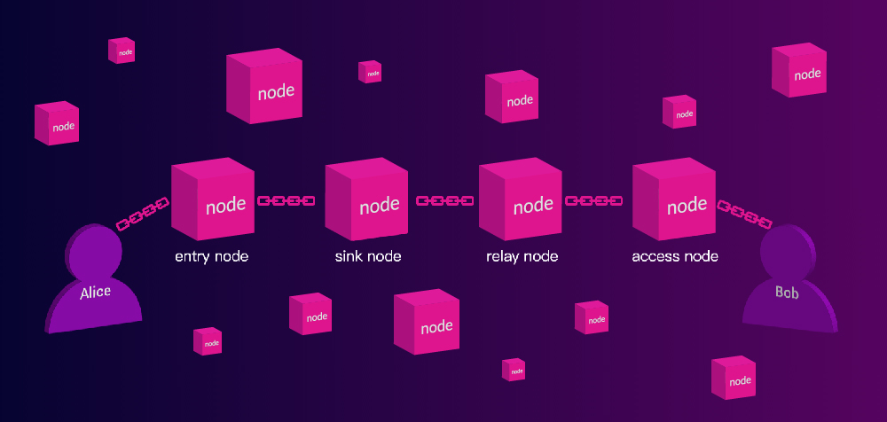

# WhiteNoise Protocol

## Abstract

WhiteNoise is a privacy network protocol for Evanesco Layer0 Network. It is designed to provide comprehensive network
privacy protection, including link privacy, node privacy, data privacy and traffic privacy.

WhiteNoise network is a decentralized and open network. Anyone can act as a Node participate in the network to relay
data transmissions, or a Client to use private connections.

WhiteNoise Protocol has superior robustness, ease of use, and cross-platform. It can provide safe and reliable
transmission capabilities in a very friendly manner, allowing upper-layer applications to easily and confidently focus
on their own business innovations. The privacy of the data is guaranteed by WhiteNoise.

## Architecture

WhiteNoise adopts a two-layer network architecture model: the first layer is a loosely connected network constructed
based on the Kademlia DHT routing . On this layer of the network, we use the gossip protocol to subscribe and distribute
messages for upper network.

The second layer is a privacy circuit network constructed based on the WhiteNoise protocol. WhiteNoise nodes in the
first layer act as routing nodes and build a multi-hop circuit for P2P clients connection.

Applications may use client SDK to access to WhiteNoise network. They are able to start and maintain circuit connections
to other clients for own functions.

## Features

- Without loss of privacy, WhiteNoise has a multi-hop circuit connection providing better privacy protection than VPN
  and dVPN schemes;
- Unlike Tor, No One can know the entire circuit connection, even both sides of the connection;
- In addition to regular link privacy, identity privacy and data privacy, it also has the capability of traffic privacy;
- Messages are encrypted and encapsulated, and each node can only see the content related to the current node. Our
  end-to-end encryption scheme speed up data transmission;
- Secure handshake based on Noise Protocol;

## Protocol

### 1. Circuit Connection

Normally a circuit connection is composed of Entry node, Sink node, Relay node and an Access node. Link privacy means
that any node cannot fully learn about the entire circuit.

For ease of description, we define the two clients building circuit connection: Alice and Bob. Define the nodes that
Alice and Bob registered to access the WhiteNoise network as Enter Node and Access Node, respectively;

First, Alice will inform Enter Node the hash of Bob's WhiteNoiseID (unique client identity), requesting it to build a
circuit to Bob.

After Entry Node get such request, it will gossip a message in the first layer network. The message is encrypted by
Alice based on ECIES scheme, and only Bob is able to decrypt. It contains the following information:

- Unique SessionID of the circuit

  From a global perspective, each node may be responsible for forwarding multiple data streams. The SessionID is used to
  indicate the path of data flow forwarding between various nodes to ensure the correctness of the data flow direction.

- Hash of Bob's WhiteNoiseID

  Each node in the first layer network will receive the gossip message. When Access Node finds that Bob, implied in the
  gossip message, is his client, it will respond to this gossip and start building connections.

- Sink Node ID

  The Sink Node of this circuit is chosen and the Access Node will build a connection to this Sink Node through one or
  more Relay Nodes.

Finally circuit connection is basically done, and the circuit connection is like:

**Alice ⟷ EntryNode ⟷ Sink Node ⟷ Relay Node (or nodes)
⟷ Access Node ⟷ Bob**

### Data Secure

After the circuit is established, the security of the data has not yet been guaranteed. Alice and Bob will build key
agreement through a handshake, and conduct encrypted communication through the shared secret key. The process works as
follows:

1. After receiving the circuit success message, Alice initiates a handshake to Bob through the circuit connection.
2. After Bob accepts circuit success message, he responds to the handshake via the circuit connection.
3. After the handshake based on the [Noise Protocol](https://noiseprotocol.org/) (**XX** handshake pattern), both
   clients upgrade a secure circuit connection.

### ID Privacy

Connections between nodes is based on IP addresses, which is determined by the Transport layer, and we won't make
adjustments. But for circuit connections, we use WhiteNoiseID to define client's identity. Which is derived from keypair
of client's account, which have nothing to do with IP address.

Also only hash of the WhiteNoiseID is broadcast through gossip. So network nodes are not able to know the WhiteNoiseID
of both clients in a circuit connection.

### Traffic Privacy

For data transmission between adjacent nodes, WhiteNoise will perform traffic confusion and time jitter on the data
packet before each time it is sent. In order to ensure that the monitors cannot accurately perceive the entire circuit
connection with conventional traffic analysis strategies. The amount of confusion and jitter is completely random and
unpredictable.

