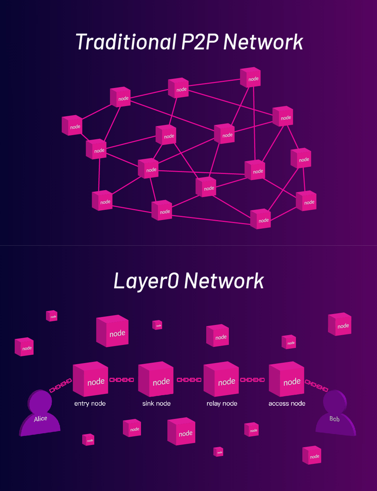

## WhiteNoise Workflows

WhiteNoise is an Overlay network protocol that consists of many decentralized routing nodes to form the WhiteNoise network, which can provide P2P privacy network services externally. The protocol establishes a multi-hop link for each pair of clients through the routing node in the WhiteNoise network, and the clients could communicate privately through this link.

Usually, a multi-hop link comprises Entry nodes, Sink nodes, Relay nodes and Access Node. The purpose of WhiteNoise to construct a multi-hop link is to ensure that Any node that composes the complete communication link cannot thoroughly learn each participating node of the whole connection.

### Establishment Process of Link:

As shown in the Figure, the process Alice establishes a connection with Bob:

1. Alice registers to the Entry node, and Bob registers to the Access node
2. Alice send request to the Entry node to dial Bob. Hash of Bob's WhiteNoiseID is in the request.
3. Entry node randomly picks a Sink node from all peers and connects to it.
4. Alice uses ECIES scheme to encrypt a gossip message and only Bob is able to decrypt. She then passes the message to the Entry node.
5. The Entry node broadcasts the gossip message.
6. The Access node accepts the encrypted gossip message and gives it to Bob.
7. Bob decrypts the gossip message and pass it to the Access node.
8. The Access node randomly pick a Relay node from all peers and connects to it.
9. The Access node asks the Relay node to extend the connection to Sink node.
10. Link the Relay node to the Sink node

So far, the establishment completed of the non-secure link including four nodes. The message flow of the two clients as follows:

Alice sends a message: Alice -> Entry -> Sink -> Relay -> Access -> Bob

Bob sends a message: Bob -> Access -> Relay -> Sink -> Entry -> Alice

11. **Handshake**

At this time, the link is still non-encrypted. Alice and Bob need to send and receive messages on this link to perform a handshake.

The handshake based on the Noise Protocol XX pattern, and the message sent three times. The directions are as follows:

1. Alice -> Bob
2. Bob -> Alice
3. Alice -> Bob

After complete the handshake, Alice and Bob upgrade the link to a secure connection.

Completed!

